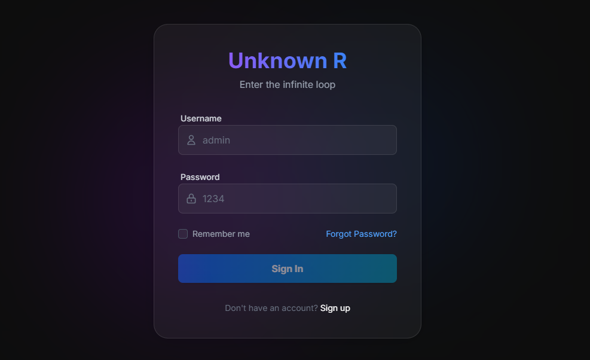
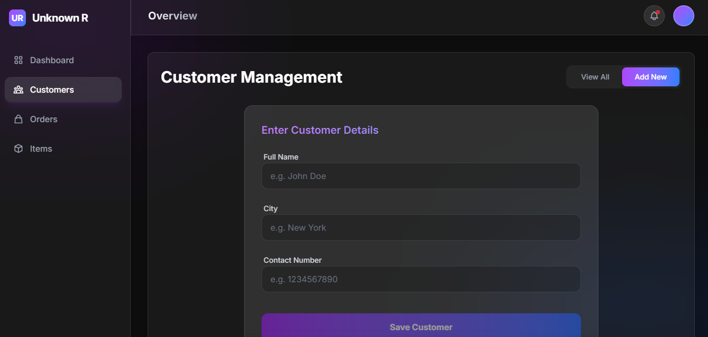
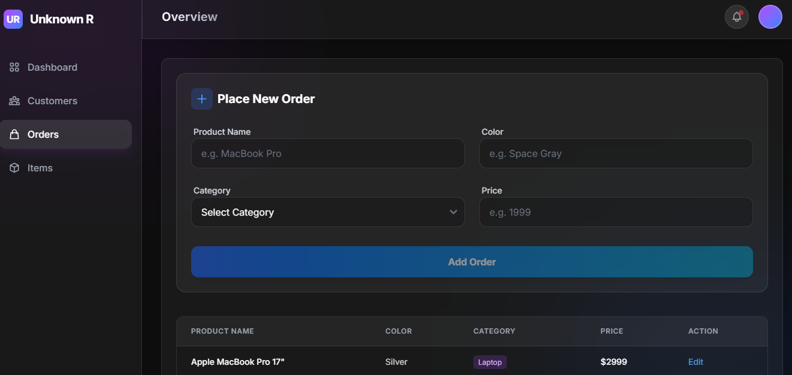

This project was generated using [Angular CLI](https://github.com/angular/angular-cli) version 21.1.3.
# 📝 CMS Angular 

> A modern, scalable, and responsive Content Management System (CMS) built with Angular.


## 📖 Description

**CMS Angular** is a robust frontend application designed to streamline content creation, user management, and administrative workflows. Built heavily on modern Angular architectural patterns, it provides an intuitive dashboard for administrators to manage digital content seamlessly. Whether you are managing blog posts, user roles, or dynamic site data, this CMS is designed for high performance and maintainability.

---

## 📸 Screenshots

*(Replace the placeholder images below by placing your actual `.png` files into the `assets/` folder of your project root)*

### Login page



### Content Editor



---

## ✨ Features

* **📊 Interactive Dashboard:** Visualized data and statistics at a glance.
* **👥 User & Role Management:** Easily assign permissions and manage user accounts.
* **✍️ Rich Content Management:** Create, read, update, and delete (CRUD) operations for all content types.
* **📱 Fully Responsive UI:** Optimized for desktop, tablet, and mobile devices.
* **🔒 Secure Authentication:** JWT-based authentication guards and role-based routing.
* **⚡ High Performance:** Lazy-loaded modules and optimized state management.

---

## 🛠️ Tech Stack

* **Framework:** [Angular](https://angular.io/)
* **Language:** [TypeScript](https://www.typescriptlang.org/)
* **Styling:** SCSS / CSS 
* **State Management:** RxJS (and/or NgRx depending on implementation)
* **HTTP Client:** Angular HttpClient for seamless API integration

---

## 🚀 Getting Started

Follow these instructions to get a copy of the project up and running on your local machine for development and testing purposes.

### Prerequisites

Ensure you have the following installed on your local environment:
* [Node.js](https://nodejs.org/) (v16.x or higher recommended)
* [Angular CLI](https://angular.io/cli) (`npm install -g @angular/cli`)

### Installation

1. **Clone the repository:**
   ```bash
   git clone [https://github.com/aravinda-dev2004/CMS-angular.git](https://github.com/aravinda-dev2004/CMS-angular.git)
